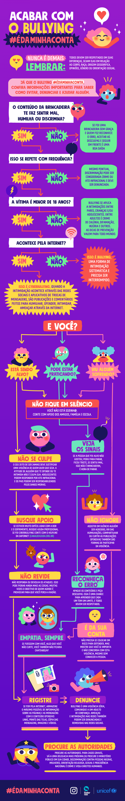

<!DOCTYPE html>
<html lang="pt-Br">
    <head>
        <meta charset="UTF-8">
        <meta http-equiv="X-UA-Compatible" content="IE=edge">
        <meta name="viewport" content="width=device-width, initial-scale=1.0">
        <title>Escola Escuta</title>
        <link rel="stylesheet" href="style.css">
        <link rel="preconnect" href="https://fonts.googleapis.com">
        <link rel="preconnect" href="https://fonts.gstatic.com" crossorigin>
    </head>
    
    <body>
        
        <header class="cabeçalho">
            
            <ul class="cabeçalho-lista">
                <a href="https://wa.me/43991931693">
                    Entre em contato
                    
                </a>
            </ul>
        </header>
        
        <section class="Escola">
            

                <h2 class="titulo">𝔼𝕤𝕔𝕠𝕝𝕒 𝔼𝕤𝕔𝕦𝕥𝕒</h2>
                

                    A Secretaria da Educação deu início, neste ano, ao projeto Escola Escuta, voltado ao cuidado com a saúde socioemocional dos(as) estudantes. 
                    Trata-se de uma ideia bem intencionada, em especial diante do cenário de temor gerado por atentados e ameaças, que exige atenção redobrada à saúde mental da comunidade escolar.
                

            

            
        </section>
    
        <section>
            

                
            

        <section>

        <section>
            <footer class="rodape">
                
                
            </footer> 
            <h2 class="titulo-final">𝕆 𝕡𝕠𝕕𝕖𝕣 𝕕𝕒 𝕖𝕤𝕔𝕦𝕥𝕒</h2>
            

                
Saber escutar não é fácil, na correria do dia a dia, sempre achamos que o que temos a dizer é mais importante, que o meu problema é maior, tenho pressa, vive-se um momento em que não se pode perder um segundo, mas esse segundo que paramos pode ser crucial para alguém, adulto, criança ou adolescente. Precisamos aprender a escutar.

            

        </section>
    </body>
</html> 
